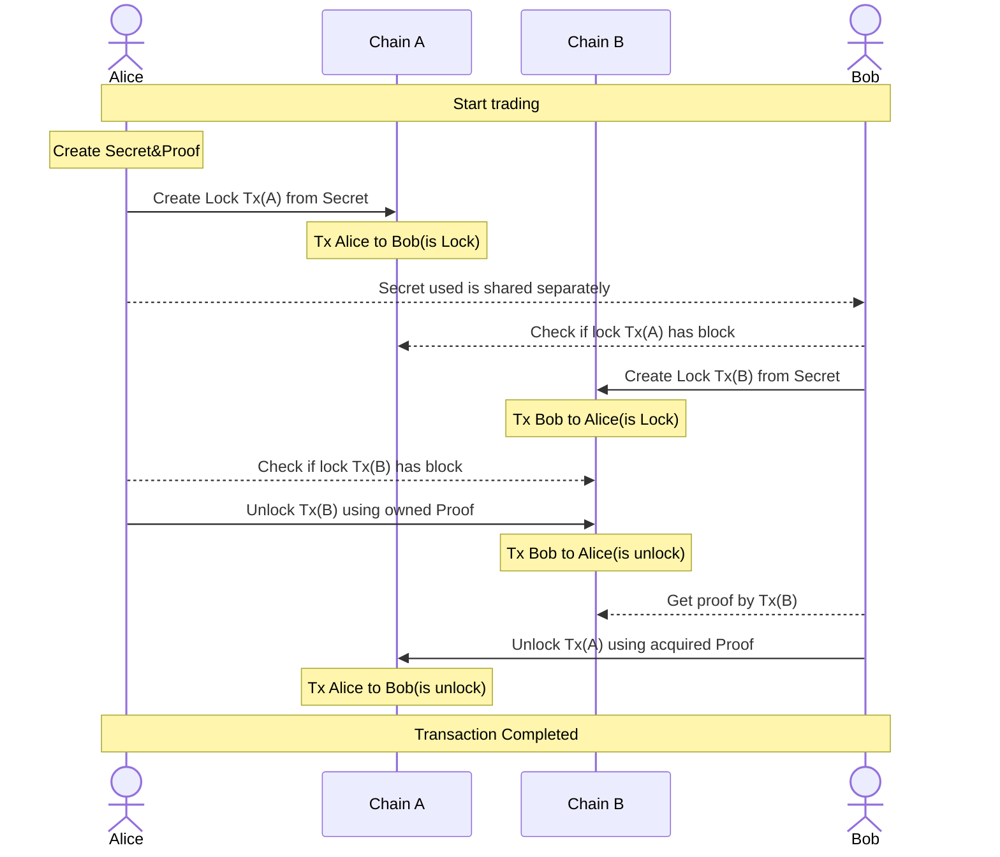

# Layerswap Atomic Bridge
=========================

## Introduction

This repository facilitate trustless Hash Time-Locked Contracts ([HTLCs](https://en.bitcoin.it/wiki/Hash_Time_Locked_Contracts)) transactions between different blockchain networks, currently supporting Bitcoin and Ethereum.
This project leverages the inherent security and trustless nature of blockchain technology to enable direct, secure exchanges.

The whole idea is based on the well-known HTLC contracts, where HTLC means "Hashed Timelock Contract".

Table of contents
=================

<!--ts-->
- [Layerswap Atomic Bridge](#layerswap-atomic-bridge)
  - [Introduction](#introduction)
- [Table of contents](#table-of-contents)
  - [Supported Networks](#supported-networks)
  - [Problem](#problem)
  - [Atomic Swap](#atomic-swap)
      - [Step-by-Step Process:](#step-by-step-process)
      - [Corner Cases:](#corner-cases)
  - [Bitcoin Script](#bitcoin-script)
  - [Prerequisites](#prerequisites)
  - [Getting Started](#getting-started)
      - [Building the project](#building-the-project)
  - [Tutorial](#tutorial)
      - [Executing the Bitcoin HTLC](#executing-the-bitcoin-htlc)
      - [Setting Up the Ethereum HTLC](#setting-up-the-ethereum-htlc)
      - [Withdrawing from Ethereum HTLC](#withdrawing-from-ethereum-htlc)
      - [Claiming Bitcoin from the HTLC](#claiming-bitcoin-from-the-htlc)
  - [Diagram](#diagram)

<!--te-->

## Supported Networks

- Bitcoin
  - [Learn more about Bitcoin](https://bitcoin.org/)
  - Bitcoin HTLC package can be found [here](./packages/bitcoin/README.md)
- Ethereum
  - [Learn more about Ethereum](https://ethereum.org/)
  - Ethereum HTLC package can be found [here](./packages/evm/README.md)

## Problem
Suppose there are two different blockchain networks, Bitcoin and Ethereum. Alice has a certain amount of Bitcoin (X BTC), and Bob has a certain amount of Ethereum (Y ETH). They want to exchange their assets directly without involving a third party.

How can they do this? How can they ensure that this transaction is secure, which means neither party is at risk of losing their assets?

## Atomic Swap

The Hashed Timelock Contract (HTLC) contract can solve this problem. An HTLC is a smart contract that locks the transaction and requires that the receiver of a payment either acknowledge receiving the payment before a deadline by revealing secret key of payment or forfeit the ability to claim the payment, returning it to the sender. This mechanism ensures that the swap can only occur if both parties fulfill their obligations.

#### Step-by-Step Process:

**Agreement:**
Alice and Bob agree that Alice will send X BTC to Bob in exchange for Y ETH (and vice versa for Bob). Alice provides an address to receive ETH, and Bob does the same for BTC.

**HTLC Creation by Alice for BTC:**
Alice generates a secret key and creates an HTLC on the Bitcoin network. This contract locks her X BTC and specifies:
- The receiver's address (provided by Bob) where the BTC will be sent if the swap is successful.
- A SHA256 hashed version of the secret key (aka hashlock).
- A timelock (e.g., 48 hours), after which Alice can reclaim her BTC if the contract conditions are not met.

**HTLC Verification and Creation by Bob for ETH:**
Bob, after verifying Alice's HTLC, creates a similar HTLC on the Ethereum network using the same hashed secret provided by Alice. This contract locks his Y ETH with a shorter timelock (e.g., 24 hours) to ensure Alice has to act first to complete the swap.

**Alice Claims ETH:**
Alice uses her secret key (preimage) to claim Y ETH from Bob's HTLC on the Ethereum network. In doing so, the secret key is revealed on the network.

**Bob Claims BTC:**
Bob uses the revealed secret key to claim X BTC from Alice's HTLC on the Bitcoin network

#### Corner Cases:
- If Bob doesn't create the ETH HTLC: Alice waits until her BTC HTLC's timelock expires, then refunds her X BTC.
- If Alice doesn't reveal the secret key: Bob waits until his ETH HTLC's timelock expires, then refunds his Y ETH.
- If Alice tries to claim the ETH and then refund her BTC: Not possible, as Alice's HTLC has a longer timelock, ensuring she acts in good faith to complete the swap.

## Bitcoin Script

Bitcoin script for implementing HTLC contract. The implementation is written in script as an array of [opcodes](https://en.bitcoin.it/wiki/Script#Opcodes):

```bash
OP_IF
  OP_HASH256
  <hash of secret>
  OP_EQUAL
  <pubKey of swap>
  OP_CHECKSIG
OP_ELSE
  <locktime>
  OP_CHECKLOCKTIMEVERIFY
  OP_DROP
  <pubKey of refund>
  OP_CHECKSIG
OP_ENDIF
```
The [Hashlock](https://en.bitcoin.it/wiki/Hashlock) is the first component of the script, executed when  `OP_IF`  reads a  `true`. It hashes the secret and checks that it matches a given hash, then it checks the signature against the given `<pubKey of swap>` (public key is provided in the script itself). If they match, the script execution continues; otherwise, the script fails here.

The [Timelock ](https://en.bitcoin.it/wiki/Timelock) is the second component of the script, activated when `OP_IF` evaluates to `false`. Here, `OP_CHECKLOCKTIMEVERIFY` (CLTV) examines whether the current block's timestamp or height meets or exceeds a predefined `<locktime>` value encoded in the script, ensuring the transaction can only proceed after this moment.
The script then presents a specified public key (`<pubKey of refund>`), associated with the party eligible to reclaim the funds (typically the original sender). If the signature is valid, the script execution proceeds, allowing for the secure refund of the funds.

[Interact with Bitcoin HTLC smart contract](https://github.com/layerswap/layerswap-atomic-bridge/tree/main/examples/bitcoin#interact-with-bitcoin)

## Prerequisites

- Node.js and npm installed on your machine.
- Basic understanding of Bitcoin transactions, Smart Contracts, HTLC

## Getting Started

Clone the repository to your local machine:

```bash
git clone git@github.com:layerswap/layerswap-atomic-bridge.git

# navigate to the project directory
cd layerswap-atomic-bridge

# install dependencies
npm install
```

#### Building the project

Once you have cloned the repository and installed all dependencies, you can build the project by running the build command. This command will compile the TypeScript files and make sure everything is set up correctly.

```bash
npm run build
```

This command executes the build scripts defined in the `package.json` file. It sequentially builds each package defined within the monorepo, ensuring that all necessary components are compiled and ready for use.

> If you are working on a specific package, such as the `bitcoin` package, and wish to only build that package, you can do so by running:
> ```bash
> npm run build:bitcoin
> ```

---

## Tutorial

Atomic Swap Between Bitcoin and Ethereum Networks.

> Before attempting the atomic swap, ensure you've followed the Getting Started and Building the Project sections.

You will need two terminals to interact with Bitcoin and Ethereum networks.

Open two terminal windows. In the first terminal, navigate to the Bitcoin example directory:
```bash
cd examples/bitcoin
```

In the second terminal, navigate to the Ethereum example directory:
```bash
cd examples/evm
```

#### Executing the Bitcoin HTLC
In the first terminal, initiate the Bitcoin HTLC process which generates the proof, hashed version of it, and creates the contract by running:
```bash
npm run start:htlc
```
Upon successful execution, you'll receive a hashlock (hashed version of the secret), contract address, and witness script (redeem script). *Note these down as they will be used in the Ethereum HTLC.

#### Setting Up the Ethereum HTLC
In the second terminal, open the `src/native/lock.ts` file and configure it with the `hashlock` obtained from the Bitcoin HTLC step.
Still in the Ethereum example directory, create the HTLC on the Ethereum network by running:
```bash
npm run start:lock
```

#### Withdrawing from Ethereum HTLC
After the Ethereum HTLC is created, open the `src/native/withdraw.ts` file and configure `contractId` and `proof`(secret key), execute the withdrawal by running:
```bash
npm run start:withdraw
```
This step reveals the secret key.

#### Claiming Bitcoin from the HTLC
Switch back to the first terminal. Now that the secret key is revealed, open the `src/withdraw.ts` file and configure arguments `hash` (btc transaction hash), `contractAddress` (btc contract address), `witnessScript` (reedem script) and `proof` (secret key), then execute the command to claim the BTC by running:
```bash
npm run start:withdraw
```

You just executed an atomic swap between the Bitcoin and Ethereum networks using HTLC.

## Diagram
An example of a flow is shown below.


