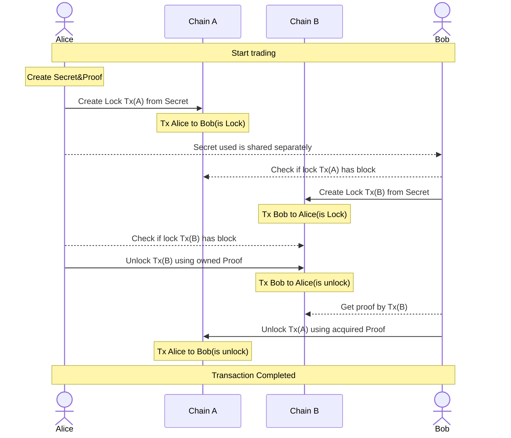

# Layerswap Atomic Bridge

---

## Example

A lock transaction is created to execute HTLC and initiate the transaction.
The executor keeps the generated Proof and shares the Secret with the counterparty.

```ts
async function lock() {
  // setup
  const client = new SymbolHtlc(
    SYMBOL.NETWORK.ENDPOINT,
    NetworkType.TEST_NET,
    SYMBOL.NETWORK.GENERATION_HASH_SEED,
    SYMBOL.NETWORK.EPOCH_ADJUSTMENT
  );
  const recipientAccount = Account.createFromPrivateKey(SYMBOL.PRIVATEKEY.TO, NetworkType.TEST_NET);
  const senderAccount = Account.createFromPrivateKey(SYMBOL.PRIVATEKEY.FROM, NetworkType.TEST_NET);
  const hashPair = client.createHashPair();
  // lock
  const transaction = client.lock(recipientAccount.address.plain(), SYMBOL.CURRENCY.MOSAIC_ID, hashPair.secret, 1);
  const signedTx = await client.sign(SYMBOL.PRIVATEKEY.FROM, transaction);
  console.log('----- wait until transaction is approved -----', {
    fromAddress: senderAccount.address.pretty(),
    toAddress: recipientAccount.address.pretty(),
    transactionHash: signedTx.hash,
    proof: hashPair.proof,
    secret: hashPair.secret,
  });
  // Wait for secret transaction to be approved
  await waitConfirmedTransaction(SYMBOL.NETWORK.ENDPOINT, senderAccount.address, signedTx.hash);
}

async function start() {
  await lock();
}
```

When a transaction is completed, you will receive tokens from the block.
The Proof generated at this time is used.

```ts
async function withDraw(proof: string, secret: string) {
  const client = new SymbolHtlc(
    SYMBOL.NETWORK.ENDPOINT,
    NetworkType.TEST_NET,
    SYMBOL.NETWORK.GENERATION_HASH_SEED,
    SYMBOL.NETWORK.EPOCH_ADJUSTMENT
  );
  const recipientAccount = Account.createFromPrivateKey(SYMBOL.PRIVATEKEY.TO, NetworkType.TEST_NET);
  const drawTx = client.withDraw(recipientAccount.address.plain(), proof, secret);
  const signedTx = await client.sign(recipientAccount.privateKey, drawTx);
  console.log('waiting...', signedTx.hash);
  await waitConfirmedTransaction(SYMBOL.NETWORK.ENDPOINT, recipientAccount.address, signedTx.hash);
  console.log(signedTx);
}

async function start() {
  const proof = '************************';
  const secret = '************************';
  await withDraw(proof, secret);
}
```

An example of a flow is shown below.
※ If you cannot see the following as a figure, please check with your browser.


