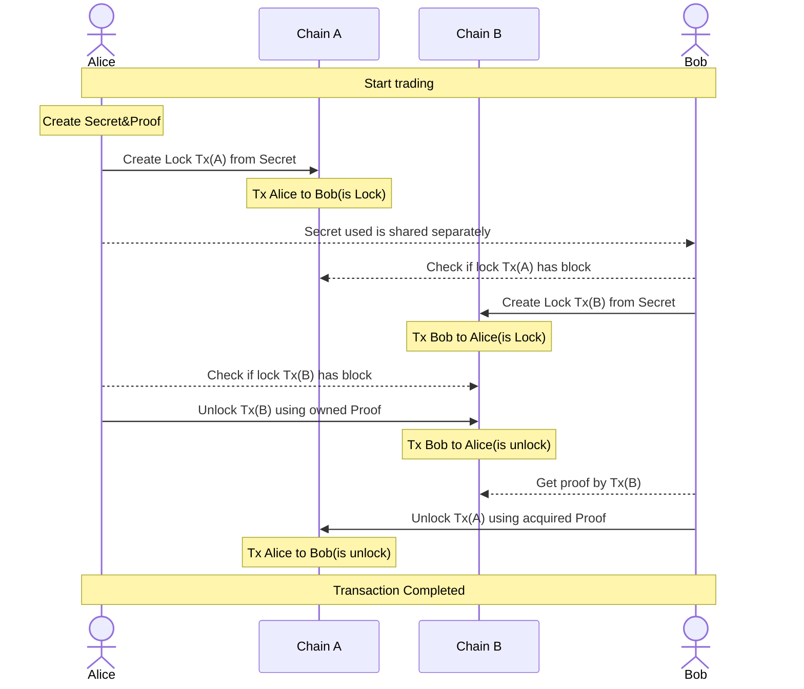

# Layerswap Atomic Bridge

---

## Example

A lock transaction is created to execute HTLC and initiate the transaction.
The executor keeps the generated Proof and shares the Secret with the counterparty.

```ts
async function lock() {
  const ECPair = ECPairFactory(ecc);
  const { WIF } = BITCOIN;
  const Alice = ECPair.fromWIF(WIF.FROM, bitcoin.networks.testnet);
  const Bob = ECPair.fromWIF(WIF.TO, bitcoin.networks.testnet);

  const swap = new BitcoinHtlc(bitcoin.networks.testnet);

  const hashPair = swap.createHashPair();
  console.log('hashPair', hashPair);

  const lock = await swap.lock(Alice, Bob, hashPair.secret, 7000, { fee: 1800, lockHeight: 2 });
  console.log(lock);
}

async function start() {
  await lock();
}

start();
```

When a transaction is completed, you will receive tokens from the block.
The Proof generated at this time is used.

```ts

async function withDraw(hash: string, contractAddress: string, witnessScript: string, proof: string) {
  const { WIF } = BITCOIN;
  const ECPair = ECPairFactory(ecc);
  const Bob = ECPair.fromWIF(WIF.TO, bitcoin.networks.testnet);
  const swap = new BitcoinHtlc(bitcoin.networks.testnet);
  return await swap.withdraw(hash, contractAddress, witnessScript, Bob, proof);
}

async function start() {
  const hash = '************************';
  const contractAddress = '************************';
  const witnessScript = '************************';
  const proof = '************************';
  await withDraw(hash, contractAddress, witnessScript, proof);
}

start();
```

An example of a flow is shown below.
※ If you cannot see the following as a figure, please check with your browser.


