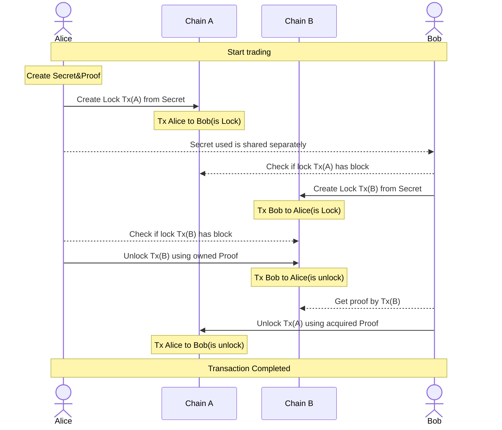

# Layerswap Atomic Bridge

## Introduction
...

## Prerequisites

- Node.js and npm installed on your machine.

## Getting Started

Clone the repository to your local machine:

```bash
git clone git@github.com:layerswap/layerswap-atomic-bridge.git

# navigate to the project directory
cd layerswap-atomic-bridge

# install dependencies
npm install
```

#### Building the project

Once you have cloned the repository and installed all dependencies, you can build the project by running the build command. This command will compile the TypeScript files and make sure everything is set up correctly.

```bash
npm run build
```

This command executes the build scripts defined in the `package.json` file. It sequentially builds each package defined within the monorepo, ensuring that all necessary components are compiled and ready for use.

> If you are working on a specific package, such as the `bitcoin` package, and wish to only build that package, you can do so by running:
> ```bash
> npm run build:bitcoin
> ```

## Bitcoin Script

Bitcoin script for implementing [HTLC](https://en.bitcoin.it/wiki/Hash_Time_Locked_Contracts) contract. The implementation is written in script as an array of [opcodes](https://en.bitcoin.it/wiki/Script#Opcodes):

```bash
OP_IF
  OP_HASH256
  <hash of secret>
  OP_EQUAL
  <pubKey of swap>
  OP_CHECKSIG
OP_ELSE
  <locktime>
  OP_CHECKLOCKTIMEVERIFY
  OP_DROP
  <pubKey of refund>
  OP_CHECKSIG
OP_ENDIF
```
The [Hashlock](https://en.bitcoin.it/wiki/Hashlock) is the first component of the script, executed when  `OP_IF`  reads a  `true`. It hashes the secret and checks that it matches a given hash, then it checks the signature against the given `<pubKey of swap>` (public key is provided in the script itself). If they match, the script execution continues; otherwise, the script fails here.

The [Timelock ](https://en.bitcoin.it/wiki/Timelock) is the second component of the script, activated when `OP_IF` evaluates to `false`. Here, `OP_CHECKLOCKTIMEVERIFY` (CLTV) examines whether the current block's timestamp or height meets or exceeds a predefined `<locktime>` value encoded in the script, ensuring the transaction can only proceed after this moment.
The script then presents a specified public key (`<pubKey of refund>`), associated with the party eligible to reclaim the funds (typically the original sender). If the signature is valid, the script execution proceeds, allowing for the secure refund of the funds.

[Interact with Bitcoin HTLC smart contract](https://github.com/layerswap/layerswap-atomic-bridge/tree/main/examples/bitcoin#interact-with-bitcoin)

---

## Example

A lock transaction is created to execute HTLC and initiate the transaction.
The executor keeps the generated Proof and shares the Secret with the counterparty.

```ts
async function lock() {
  const ECPair = ECPairFactory(ecc);
  const { WIF } = BITCOIN;
  const Alice = ECPair.fromWIF(WIF.FROM, bitcoin.networks.testnet);
  const Bob = ECPair.fromWIF(WIF.TO, bitcoin.networks.testnet);

  const swap = new BitcoinHtlc(bitcoin.networks.testnet);

  const hashPair = swap.createHashPair();
  console.log('hashPair', hashPair);

  const lock = await swap.lock(Alice, Bob, hashPair.secret, 7000, { fee: 1800, lockHeight: 2 });
  console.log(lock);
}

async function start() {
  await lock();
}

start();
```

When a transaction is completed, you will receive tokens from the block.
The Proof generated at this time is used.

```ts

async function withDraw(hash: string, contractAddress: string, witnessScript: string, proof: string) {
  const { WIF } = BITCOIN;
  const ECPair = ECPairFactory(ecc);
  const Bob = ECPair.fromWIF(WIF.TO, bitcoin.networks.testnet);
  const swap = new BitcoinHtlc(bitcoin.networks.testnet);
  return await swap.withdraw(hash, contractAddress, witnessScript, Bob, proof);
}

async function start() {
  const hash = '************************';
  const contractAddress = '************************';
  const witnessScript = '************************';
  const proof = '************************';
  await withDraw(hash, contractAddress, witnessScript, proof);
}

start();
```

An example of a flow is shown below.
※ If you cannot see the following as a figure, please check with your browser.


