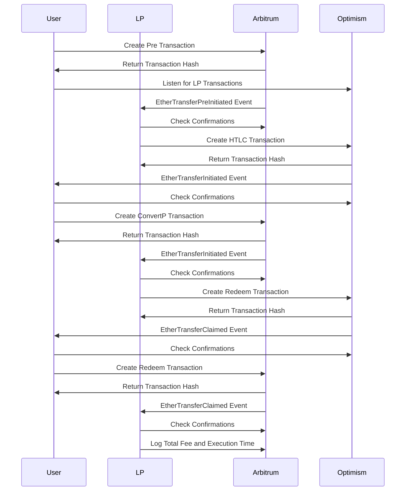

### Transaction Flow

1. **User Script Initialization:**
   - Import necessary modules and configuration.
   - Initialize PreEvmHtlc clients for Arbitrum and Optimism networks.
   - Add the user’s private key to the wallet and set up the user’s address and timelock.

2. **CreatePre Transaction:**
   - User creates a Pre HTLC transaction on the Arbitrum network.
   - Log the transaction hash and start listening for LP transactions on Optimism.

3. **Listen for LP Transactions:**
   - Listen for `EtherTransferInitiated` and `EtherTransferClaimed` events on Optimism.
   - Process these events when detected.

4. **Process EtherTransferInitiated Event:**
   - Check and wait for LP transaction confirmations (Default blocks: 12).
   - Create a ConvertP transaction on Arbitrum with the hashlock and phtlcID.

5. **Process EtherTransferClaimed Event:**
   - Check and wait for LP transaction confirmations.
   - Create a Redeem transaction on Arbitrum using the secret from the HTLC info (getHTLCDetails).

6. **Calculate and Log Fees and Execution Time:**
   - Accumulate gas used for all transactions.
   - Log total gas used and execution time at the end of the process.

7. **LP Script Initialization:**
   - Import necessary modules and configuration.
   - Initialize PreEvmHtlc clients for Arbitrum and Optimism networks.
   - Add the LP’s private key to the wallet.

8. **Listen for User Transactions:**
   - Listen for `EtherTransferPreInitiated`, `EtherTransferInitiated`, and `EtherTransferClaimed` events on Arbitrum.
   - Process these events when detected.

9. **Process EtherTransferPreInitiated Event:**
   - Check and wait for transaction confirmations.
   - Create an HTLC transaction on Optimism using the provided phtlcID and other details.

10. **Process EtherTransferInitiated Event:**
   - Check and wait for user transaction confirmations.
   - Create a Redeem transaction on Optimism with the hashlock.

11. **Process EtherTransferClaimed Event:**
    - Check and wait for user transaction confirmations.
    - Log total gas used and execution time at the end of the process.

### Transaction Fee Calculation
- Formula: totalCost = gasPrice * totalGasUsed
- Gas Price: Fetched at the beginning of the script, representing the average price from the oracle at that time.

### Configurable Environment Variables

- `CONFIRMATION_THRESHOLD`: The number of confirmations required to consider a transaction successful
- `ARBITRUM_MESSANGER_ADDRESS`: The messenger address for the Arbitrum network.
- `ARBITRUM_RPC_ENDPOINT`: RPC endpoint for the Arbitrum network.
- `ARBITRUM_WSS_ENDPOINT`: WebSocket endpoint for the Arbitrum network.
- `LP_ADDRESS`: Liquidity Provider's address.
- `LP_PRIVATE_KEY`: Liquidity Provider's private key.
- `OPTIMISM_MESSANGER_ADDRESS`: The messenger address for the Optimism network.
- `OPTIMISM_RPC_ENDPOINT`: RPC endpoint for the Optimism network.
- `OPTIMISM_WSS_ENDPOINT`: WebSocket endpoint for the Optimism network.
- `PRE_HTLC_CONTRACT_ADDRESS`: Address of the PreEvmHtlc contract.
- `USER_PRIVATE_KEY`: User's private key.
- `USER_TIMELOCK_SECONDS`: Timelock duration in seconds for the user's transaction.

### Diagram

