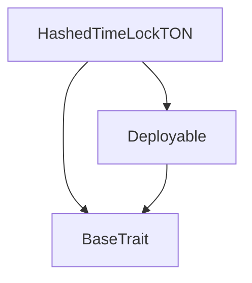

# TACT Compilation Report
Contract: HashedTimeLockTON
BOC Size: 4266 bytes

# Types
Total Types: 27

## StateInit
TLB: `_ code:^cell data:^cell = StateInit`
Signature: `StateInit{code:^cell,data:^cell}`

## Context
TLB: `_ bounced:bool sender:address value:int257 raw:^slice = Context`
Signature: `Context{bounced:bool,sender:address,value:int257,raw:^slice}`

## SendParameters
TLB: `_ bounce:bool to:address value:int257 mode:int257 body:Maybe ^cell code:Maybe ^cell data:Maybe ^cell = SendParameters`
Signature: `SendParameters{bounce:bool,to:address,value:int257,mode:int257,body:Maybe ^cell,code:Maybe ^cell,data:Maybe ^cell}`

## Deploy
TLB: `deploy#946a98b6 queryId:uint64 = Deploy`
Signature: `Deploy{queryId:uint64}`

## DeployOk
TLB: `deploy_ok#aff90f57 queryId:uint64 = DeployOk`
Signature: `DeployOk{queryId:uint64}`

## FactoryDeploy
TLB: `factory_deploy#6d0ff13b queryId:uint64 cashback:address = FactoryDeploy`
Signature: `FactoryDeploy{queryId:uint64,cashback:address}`

## Notification
TLB: `_ commitId:int257 hashlock:int257 dstChain:^string dstAsset:^string dstAddress:^string srcAsset:^string sender:address srcReceiver:address amount:int257 timelock:int257 = Notification`
Signature: `Notification{commitId:int257,hashlock:int257,dstChain:^string,dstAsset:^string,dstAddress:^string,srcAsset:^string,sender:address,srcReceiver:address,amount:int257,timelock:int257}`

## Notify
TLB: `notify#3beb51c2 data:Notification{commitId:int257,hashlock:int257,dstChain:^string,dstAsset:^string,dstAddress:^string,srcAsset:^string,sender:address,srcReceiver:address,amount:int257,timelock:int257} = Notify`
Signature: `Notify{data:Notification{commitId:int257,hashlock:int257,dstChain:^string,dstAsset:^string,dstAddress:^string,srcAsset:^string,sender:address,srcReceiver:address,amount:int257,timelock:int257}}`

## PHTLC
TLB: `_ dstAddress:^string dstChain:^string dstAsset:^string srcAsset:^string sender:address senderPubKey:int257 srcReceiver:address timelock:int257 amount:int257 messenger:address locked:bool uncommitted:bool = PHTLC`
Signature: `PHTLC{dstAddress:^string,dstChain:^string,dstAsset:^string,srcAsset:^string,sender:address,senderPubKey:int257,srcReceiver:address,timelock:int257,amount:int257,messenger:address,locked:bool,uncommitted:bool}`

## HTLC
TLB: `_ dstAddress:^string dstChain:^string dstAsset:^string srcAsset:^string sender:address srcReceiver:address hashlock:int257 secret:int257 amount:int257 timelock:int257 redeemed:bool unlocked:bool = HTLC`
Signature: `HTLC{dstAddress:^string,dstChain:^string,dstAsset:^string,srcAsset:^string,sender:address,srcReceiver:address,hashlock:int257,secret:int257,amount:int257,timelock:int257,redeemed:bool,unlocked:bool}`

## Commit
TLB: `commit#1b564d91 data:CommitData{dstChain:^string,dstAsset:^string,dstAddress:^string,srcAsset:^string,srcReceiver:address,timelock:int257,messenger:address,senderPubKey:int257,hopChains:dict<int, ^StringImpl{data:^string}>,hopAssets:dict<int, ^StringImpl{data:^string}>,hopAddresses:dict<int, ^StringImpl{data:^string}>} = Commit`
Signature: `Commit{data:CommitData{dstChain:^string,dstAsset:^string,dstAddress:^string,srcAsset:^string,srcReceiver:address,timelock:int257,messenger:address,senderPubKey:int257,hopChains:dict<int, ^StringImpl{data:^string}>,hopAssets:dict<int, ^StringImpl{data:^string}>,hopAddresses:dict<int, ^StringImpl{data:^string}>}}`

## CommitData
TLB: `_ dstChain:^string dstAsset:^string dstAddress:^string srcAsset:^string srcReceiver:address timelock:int257 messenger:address senderPubKey:int257 hopChains:dict<int, ^StringImpl{data:^string}> hopAssets:dict<int, ^StringImpl{data:^string}> hopAddresses:dict<int, ^StringImpl{data:^string}> = CommitData`
Signature: `CommitData{dstChain:^string,dstAsset:^string,dstAddress:^string,srcAsset:^string,srcReceiver:address,timelock:int257,messenger:address,senderPubKey:int257,hopChains:dict<int, ^StringImpl{data:^string}>,hopAssets:dict<int, ^StringImpl{data:^string}>,hopAddresses:dict<int, ^StringImpl{data:^string}>}`

## LockCommitment
TLB: `lock_commitment#5cdd41d9 data:LockCommitmentData{commitId:int257,hashlock:int257,timelock:int257} = LockCommitment`
Signature: `LockCommitment{data:LockCommitmentData{commitId:int257,hashlock:int257,timelock:int257}}`

## LockCommitmentData
TLB: `_ commitId:int257 hashlock:int257 timelock:int257 = LockCommitmentData`
Signature: `LockCommitmentData{commitId:int257,hashlock:int257,timelock:int257}`

## Uncommit
TLB: `uncommit#a958ac23 data:UncommitData{commitId:int257} = Uncommit`
Signature: `Uncommit{data:UncommitData{commitId:int257}}`

## UncommitData
TLB: `_ commitId:int257 = UncommitData`
Signature: `UncommitData{commitId:int257}`

## Lock
TLB: `lock#12e78cb1 data:LockData{hashlock:int257,timelock:int257,srcReceiver:address,srcAsset:^string,dstChain:^string,dstAddress:^string,dstAsset:^string,commitId:Maybe int257,messenger:Maybe address} = Lock`
Signature: `Lock{data:LockData{hashlock:int257,timelock:int257,srcReceiver:address,srcAsset:^string,dstChain:^string,dstAddress:^string,dstAsset:^string,commitId:Maybe int257,messenger:Maybe address}}`

## LockData
TLB: `_ hashlock:int257 timelock:int257 srcReceiver:address srcAsset:^string dstChain:^string dstAddress:^string dstAsset:^string commitId:Maybe int257 messenger:Maybe address = LockData`
Signature: `LockData{hashlock:int257,timelock:int257,srcReceiver:address,srcAsset:^string,dstChain:^string,dstAddress:^string,dstAsset:^string,commitId:Maybe int257,messenger:Maybe address}`

## Redeem
TLB: `redeem#758db085 data:RedeemData{lockId:int257,secret:int257} = Redeem`
Signature: `Redeem{data:RedeemData{lockId:int257,secret:int257}}`

## RedeemData
TLB: `_ lockId:int257 secret:int257 = RedeemData`
Signature: `RedeemData{lockId:int257,secret:int257}`

## Unlock
TLB: `unlock#ad821ef9 data:UnlockData{hashlock:int257} = Unlock`
Signature: `Unlock{data:UnlockData{hashlock:int257}}`

## UnlockData
TLB: `_ hashlock:int257 = UnlockData`
Signature: `UnlockData{hashlock:int257}`

## LockCommitmentSig
TLB: `lock_commitment_sig#c1d818ff data:LockCommitmentSigData{commitId:int257,data:^slice,signature:^slice} = LockCommitmentSig`
Signature: `LockCommitmentSig{data:LockCommitmentSigData{commitId:int257,data:^slice,signature:^slice}}`

## LockCommitmentSigData
TLB: `_ commitId:int257 data:^slice signature:^slice = LockCommitmentSigData`
Signature: `LockCommitmentSigData{commitId:int257,data:^slice,signature:^slice}`

## TokenCommitted
TLB: `token_committed#71f9f7aa commitId:int257 dstChain:^string dstAddress:^string dstAsset:^string sender:address srcReceiver:address srcAsset:^string amount:int257 timelock:int257 messenger:address senderPubKey:int257 hopChains:dict<int, ^StringImpl{data:^string}> hopAssets:dict<int, ^StringImpl{data:^string}> hopAddresses:dict<int, ^StringImpl{data:^string}> = TokenCommitted`
Signature: `TokenCommitted{commitId:int257,dstChain:^string,dstAddress:^string,dstAsset:^string,sender:address,srcReceiver:address,srcAsset:^string,amount:int257,timelock:int257,messenger:address,senderPubKey:int257,hopChains:dict<int, ^StringImpl{data:^string}>,hopAssets:dict<int, ^StringImpl{data:^string}>,hopAddresses:dict<int, ^StringImpl{data:^string}>}`

## TokenLocked
TLB: `token_locked#95b0219d hashlock:int257 dstChain:^string dstAddress:^string dstAsset:^string sender:address srcReceiver:address srcAsset:^string amount:int257 timelock:int257 messenger:Maybe address commitId:Maybe int257 = TokenLocked`
Signature: `TokenLocked{hashlock:int257,dstChain:^string,dstAddress:^string,dstAsset:^string,sender:address,srcReceiver:address,srcAsset:^string,amount:int257,timelock:int257,messenger:Maybe address,commitId:Maybe int257}`

## StringImpl
TLB: `_ data:^string = StringImpl`
Signature: `StringImpl{data:^string}`

# Get Methods
Total Get Methods: 8

## getLockCDetails
Argument: hashlock

## getCommitDetails
Argument: commitId

## commitsLength

## locksLength

## lockIdToCommitIdLength

## getCommits
Argument: senderAddr

## getLocks
Argument: senderAddr

## getLockIdByCommitId
Argument: commitId

# Error Codes
2: Stack underflow
3: Stack overflow
4: Integer overflow
5: Integer out of expected range
6: Invalid opcode
7: Type check error
8: Cell overflow
9: Cell underflow
10: Dictionary error
13: Out of gas error
32: Method ID not found
34: Action is invalid or not supported
37: Not enough TON
38: Not enough extra-currencies
128: Null reference exception
129: Invalid serialization prefix
130: Invalid incoming message
131: Constraints error
132: Access denied
133: Contract stopped
134: Invalid argument
135: Code of a contract was not found
136: Invalid address
137: Masterchain support is not enabled for this contract
1503: Already Unlocked
4670: Funds Not Sent
6007: Lock Already Exists
6272: Lock Does Not Exist
20173: Commitment does not exist
21683: Not Future Timelock
22150: Commit Already Exists
30789: Commit Does Not Exist
31687: No Allowance
38239: Not Passed Timelock
42324: Already Uncommitted
46722: Already Locked
46887: Already Redeemed
48401: Invalid signature
50918: Hashlock Not Match

# Trait Inheritance Diagram

# Contract Dependency Diagram

