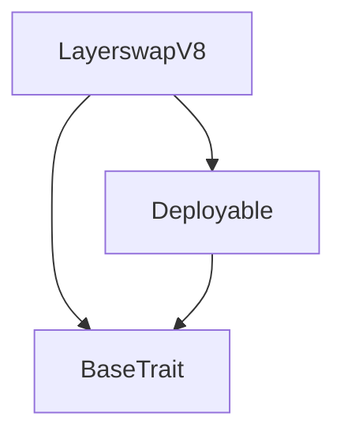
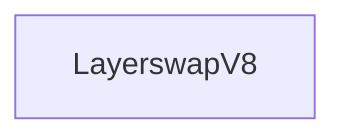

# TACT Compilation Report
Contract: LayerswapV8
BOC Size: 2893 bytes

# Types
Total Types: 16

## StateInit
TLB: `_ code:^cell data:^cell = StateInit`
Signature: `StateInit{code:^cell,data:^cell}`

## Context
TLB: `_ bounced:bool sender:address value:int257 raw:^slice = Context`
Signature: `Context{bounced:bool,sender:address,value:int257,raw:^slice}`

## SendParameters
TLB: `_ bounce:bool to:address value:int257 mode:int257 body:Maybe ^cell code:Maybe ^cell data:Maybe ^cell = SendParameters`
Signature: `SendParameters{bounce:bool,to:address,value:int257,mode:int257,body:Maybe ^cell,code:Maybe ^cell,data:Maybe ^cell}`

## Deploy
TLB: `deploy#946a98b6 queryId:uint64 = Deploy`
Signature: `Deploy{queryId:uint64}`

## DeployOk
TLB: `deploy_ok#aff90f57 queryId:uint64 = DeployOk`
Signature: `DeployOk{queryId:uint64}`

## FactoryDeploy
TLB: `factory_deploy#6d0ff13b queryId:uint64 cashback:address = FactoryDeploy`
Signature: `FactoryDeploy{queryId:uint64,cashback:address}`

## HTLC
TLB: `_ dstAddress:^string dstChain:^string dstAsset:^string srcAsset:^string sender:address senderPubKey:int257 srcReceiver:address secret:int257 hashlock:int257 amount:int257 timelock:int257 redeemed:bool refunded:bool = HTLC`
Signature: `HTLC{dstAddress:^string,dstChain:^string,dstAsset:^string,srcAsset:^string,sender:address,senderPubKey:int257,srcReceiver:address,secret:int257,hashlock:int257,amount:int257,timelock:int257,redeemed:bool,refunded:bool}`

## Commit
TLB: `commit#1b564d91 dstChain:^string dstAsset:^string dstAddress:^string srcAsset:^string srcReceiver:address timelock:int257 senderPubKey:int257 hopChains:dict<int, ^StringImpl{data:^string}> hopAssets:dict<int, ^StringImpl{data:^string}> hopAddresses:dict<int, ^StringImpl{data:^string}> = Commit`
Signature: `Commit{dstChain:^string,dstAsset:^string,dstAddress:^string,srcAsset:^string,srcReceiver:address,timelock:int257,senderPubKey:int257,hopChains:dict<int, ^StringImpl{data:^string}>,hopAssets:dict<int, ^StringImpl{data:^string}>,hopAddresses:dict<int, ^StringImpl{data:^string}>}`

## AddLock
TLB: `add_lock#5cdd41d9 Id:int257 hashlock:int257 timelock:int257 = AddLock`
Signature: `AddLock{Id:int257,hashlock:int257,timelock:int257}`

## AddLockSig
TLB: `add_lock_sig#c1d818ff data:^slice signature:^slice = AddLockSig`
Signature: `AddLockSig{data:^slice,signature:^slice}`

## Lock
TLB: `lock#12e78cb1 Id:int257 hashlock:int257 timelock:int257 srcReceiver:address srcAsset:^string dstChain:^string dstAddress:^string dstAsset:^string = Lock`
Signature: `Lock{Id:int257,hashlock:int257,timelock:int257,srcReceiver:address,srcAsset:^string,dstChain:^string,dstAddress:^string,dstAsset:^string}`

## Redeem
TLB: `redeem#758db085 Id:int257 secret:int257 = Redeem`
Signature: `Redeem{Id:int257,secret:int257}`

## Refund
TLB: `refund#ad821ef9 Id:int257 = Refund`
Signature: `Refund{Id:int257}`

## TokenCommitted
TLB: `token_committed#71f9f7aa Id:int257 dstChain:^string dstAddress:^string dstAsset:^string sender:address srcReceiver:address srcAsset:^string amount:int257 timelock:int257 senderPubKey:int257 hopChains:dict<int, ^StringImpl{data:^string}> hopAssets:dict<int, ^StringImpl{data:^string}> hopAddresses:dict<int, ^StringImpl{data:^string}> = TokenCommitted`
Signature: `TokenCommitted{Id:int257,dstChain:^string,dstAddress:^string,dstAsset:^string,sender:address,srcReceiver:address,srcAsset:^string,amount:int257,timelock:int257,senderPubKey:int257,hopChains:dict<int, ^StringImpl{data:^string}>,hopAssets:dict<int, ^StringImpl{data:^string}>,hopAddresses:dict<int, ^StringImpl{data:^string}>}`

## TokenLocked
TLB: `token_locked#95b0219d Id:int257 hashlock:int257 dstChain:^string dstAddress:^string dstAsset:^string sender:address srcReceiver:address srcAsset:^string amount:int257 timelock:int257 = TokenLocked`
Signature: `TokenLocked{Id:int257,hashlock:int257,dstChain:^string,dstAddress:^string,dstAsset:^string,sender:address,srcReceiver:address,srcAsset:^string,amount:int257,timelock:int257}`

## StringImpl
TLB: `_ data:^string = StringImpl`
Signature: `StringImpl{data:^string}`

# Get Methods
Total Get Methods: 3

## getDetails
Argument: Id

## getContractsLength

## getContracts
Argument: senderAddr

# Error Codes
2: Stack underflow
3: Stack overflow
4: Integer overflow
5: Integer out of expected range
6: Invalid opcode
7: Type check error
8: Cell overflow
9: Cell underflow
10: Dictionary error
13: Out of gas error
32: Method ID not found
34: Action is invalid or not supported
37: Not enough TON
38: Not enough extra-currencies
128: Null reference exception
129: Invalid serialization prefix
130: Invalid incoming message
131: Constraints error
132: Access denied
133: Contract stopped
134: Invalid argument
135: Code of a contract was not found
136: Invalid address
137: Masterchain support is not enabled for this contract
4670: Funds Not Sent
8650: Hashlock Already Set
11493: Contract Already Exists
21683: Not Future Timelock
24064: HTLC Already Exists
30789: Commit Does Not Exist
31687: No Allowance
38239: Not Passed Timelock
42857: HTLC Does Not Exist
46887: Already Redeemed
48401: Invalid signature
49162: Already Refunded
50918: Hashlock Not Match
58417: Contract Does Not Exist

# Trait Inheritance Diagram

# Contract Dependency Diagram

